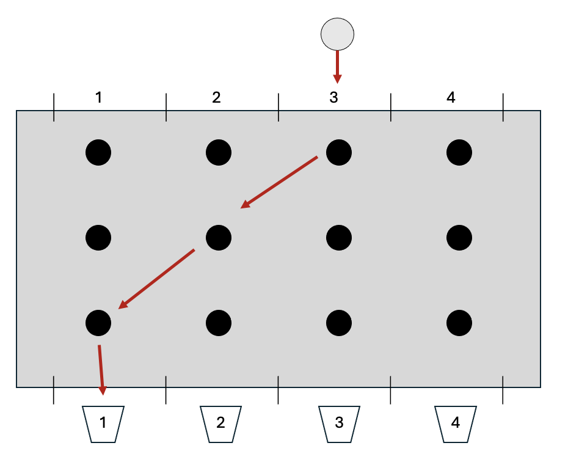
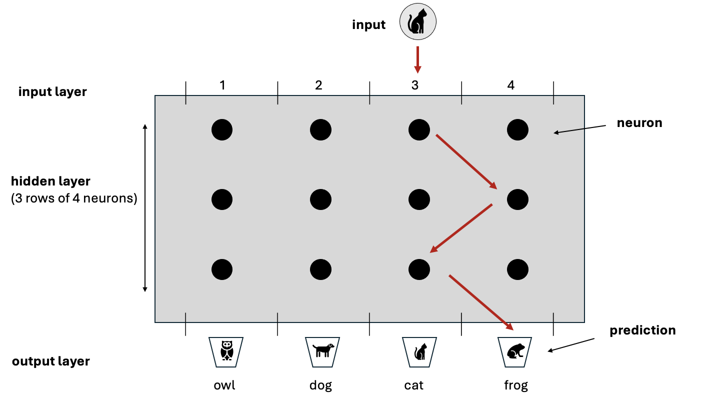
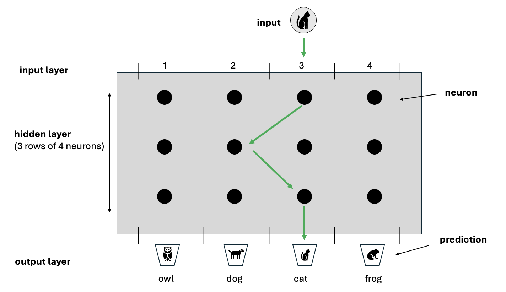

# How Neural Networks Work – A Simple Introduction

This is a simplified explanation of how neural networks work to help understanding.

---

## Part 1

### What is a Neural Network?

You can think of a neural network as a web of millions of tiny calculators linked together in rows. They perform their calculations on some input (e.g an image) to aim to produce a result. Each tiny calculator in the web is a neuron, all a neuron does is receives input data, performs a very simple calculation and sends the result to the next set of neurons. This process repeats until a final answer is provided. That is literally it.

The power of a neural network comes from the combined calculations of millions of neurons acting together. They are arranged in layers with the outputs of all neurons in one layer providing the inputs to all the neurons in the next layer and so on. Each layer could have thousands of neurons and there can be thousands of layers. For example, one of the earliest neural networks used in image recognition had over 650,000 neurons.

---

### A Simple Analogy

Have you ever seen the TV game show ‘Tipping Point’? (If you have, forgive me if I describe it slightly differently to aid explanation….)

A contestant drops a silver disc into the top of a device consisting of vertical columns arranged side by side - each column is about a metre high. For the sake of explanation, we’ll imagine there’s a bucket underneath each column with number 1, 2, 3, or 4 written on it. The silver disc is dropped into one of the columns at the top of device and makes its way down until it pops out the bottom, landing in one of the buckets. But the path through the device is blocked by a number of rods positioned at regular intervals and aligned in horizontal rows. When the disc hits a rod, it’s pushed to the left or the right. By the time it reaches the bottom, the disc could end up in a bucket to the right or left of where it was originally dropped in. The contestant is trying to get the disc to end up in a particular bucket in order to win a prize.

The diagram below shows a very simple view of how the game works - with four columns and 3 rows of rods - 4 rods in each row. The disc is placed by the contestant in column 3 but actually ends up in bucket 1 after hitting 3 rods along the way.

Conceptually, this physical device is very similar to a Neural Network. Imagine the disc has a picture on it, let’s say a picture of a cat - this is the input to the network. Next, imagine each bucket also has an image on it - e.g. a cat, an owl a frog and a dog - these represent the possible outputs of the neural network (also called the predictions). The rods are the neurons - but rather than nudging a disc, the neurons are performing a calculation on data.

The path of the disc through the device mirrors how data moves through a neural network. As the disc travels down from the top, it’s nudged by each rod until it eventually lands in a bucket at the bottom. In the same way, data passes through layers of neurons, where each neuron performs a small calculation. By the time the data reaches the final layer, the combination of all calculations performed by all the neurons produces a final result - the network’s prediction about what the input data represents.

In the example below, the rods have nudged the disc with the image on it to the far right such that it ends up in the bucket marked ‘frog’ - in the terms of a neural network, it has predicted that the image of a cat is actually an image of a frog - i.e. it guessed wrong.

---

### How could this ever work?

The secret to making correct predictions, is that each rod doesn’t nudge by the same amount. All the rods can be tuned to nudge by different amounts. If there are enough rods (and a neural network has many neurons), the combination of all nudges results in the image being placed in the correct bucket.

In neural network terms, rather than physically nudging a disc, a neuron performs a simple calculation on data. The scale of this calculation (akin to the force a rod applies) is controlled by numbers called weights. The process of tuning the weights so that the network gives the right answer is called ‘training’. Training simply adjusts these numbers (weights) through a long series of trial and error.

At the start of training, a neural network consists of neurons with randomly assigned weights. During training, the network is fed thousands of images where the contents of the image is already known. The first image is fed, each neuron performs its calculation, eventually resulting in a prediction - which will almost certainly be incorrect. Every time the network ‘predicts’ the wrong answer for an image, the weights of all the neurons are modified very slightly (through a process called back propagation) and the next image is fed in. Eventually the weights of each neuron become so finely tuned that the network starts to guess right almost every time (this is called convergence). Once the network has converged, training can be deemed to have been completed and the weights are frozen.

The network should now be able to predict whether an image it hasn’t seen before is a cat, dog, owl or frog.

Conceptually, that is it!

---

## Part 2

### What’s happening mathematically?

Each neuron in a network performs a very simple calculation which amounts to multiplying the input it receives by its weight and then applying a factor on top - the factor is called the activation:

The weight of a neuron is just a number, assigned randomly at first and then modified through training.

The input to a layer of neurons is the output from the previous layer. The first set of neurons don’t have a predecessor, their input is a numerical representation of the item we want the network to analyse - whether that be an image, a word, a piece of audio etc. All these types of input can be represented as numbers. An image, for example, is just a set of pixels where each pixel is a number from 0 to 255 (actually, for a colour image, each pixel has 3 numbers - one for each of Red, Green and Blue (RGB). For a greyscale image, there’s only one number per pixel - ranging from 0 for white up to 255 for black)

There are various types of activation, but a simple one is called Relu which essentially performs this calculation:

> If the multiplication of the input by the weight is positive, then keep that number, otherwise set the neuron’s output to zero.

---

### Is it really that simple?

Conceptually yes, but in reality there are of course extra complexities. If you’re interested and wish to know more, read on:

1. Firstly, the input to a network is not a single number but a list of numbers in a specific order - called a vector. The simplest example is an image. If a greyscale image is 4 pixels across by 4 pixels down - that gives 16 pixels in total. For a greyscale image (without colour) each pixel has a number between 0 and 255 where 0 is black, 255 is white and the values in between are shades of grey. Thus a greyscale  image can be represented simply as 16 numbers each from 0 to 255. Similarly a 1024 x 1024 greyscale image has 1,048,576 numbers. If that image is colour rather than greyscale, then each pixel has 3 numbers associated with it (i.e. the Red Green Blue numbers). Thus a  1024 x 1024 RGB colour image has 1,048,576 x 3 numbers ie 3,145,728 numbers. Formally, these collections of numbers are called vectors and the number of numbers is called the dimension of the vector. So for our simple 4x4 greyscale image we say the input is a vector of dimension 16.

2. This is important because neurons don’t actually have a single weight - they have many weights. Each neuron in the first layer has a weight for each dimension of the input. Each neuron in subsequent layers has a weight for each of the neurons in the layer before it. The number of weights can therefore explode - AlexNet developed in 2012 was trained on over 1,000,000 images, each of 224x224 pixels, it had over 650,000 neurons in 8 layers and a total of over 60,000,000 individual weights!!!! 

3. The mathematical operation that each neuron performs consists of two parts - The first part is a multiplication (called the vector dot product) - whereby each element of input vector is multiplied by its corresponding weight and the results are added up. The second part is called an activation function - common examples are tanhh, sigmoid and Relu. The Relu activation function is the simplest - it just sets the result of the neuron’s calculation to 0 if the previous step returned a negative number, otherwise it returns the result of the previous step as-is

4. The final output of the network is also a vector - the dimension of this vector is the same as the number of possible outcomes. So if the network has to classify an image as one of 4 types of animals the output vector will be of dimension 4.

5. The network is constructed so that the all values in the output vector are between 0 and 1 and that they in total add up to 1 (e.g. [0.2, 0.4, 0.1, 0.3]. This has the effect of providing a probability distribution for each possible outcome. There is a special calculation at the final step of the network which converts the output of the last layer of neurons to a probability (called the Softmax function) 

6. Remember that in training we know what’s in all the images. If there are images of 4 types of animals we will assign each type of animal to one of the elements in the output vector. Thus we might have 0: cat 1: dog 2: owl 3 :frog. For example, a frog would be represented by [0,0,0,1] and a cat by [1,0,0,0]

7. So, I the network outputs a vector [0.2, 0.4, 0.1, 0.3] we can correspond that to the network thinking with 40% certainty that the image it has been provided with is a dog (as position one has a value of 0.4) and with 30% certainty that its a frog. If in fact the image is a cat well, the network was only 20% certain that the image was a cat - thus its’ way off the mark - this is key to updating the weights

8. To tune the network, the output is compared to the correct answer to work out how ‘wrong’ the network was - this is called the ‘loss’ of the network. It’s calculated via a process called cross-entropy loss and then this loss is used to update all the weights in the network. The larger the loss the bigger the adjustment to the weights!

9. The mechanism and amount by which each of the weights are updated is based upon high-school differential calculus in a process called back-propagation. We won’t go into that here, but you can imagine it to provide a way of attributing the loss to neurons depending upon the amount their weights influenced the answer the network provided  
