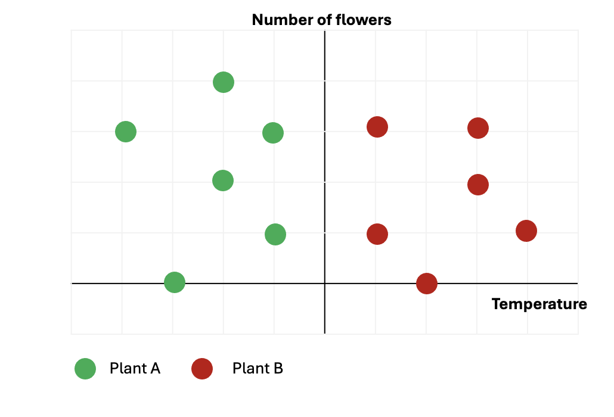
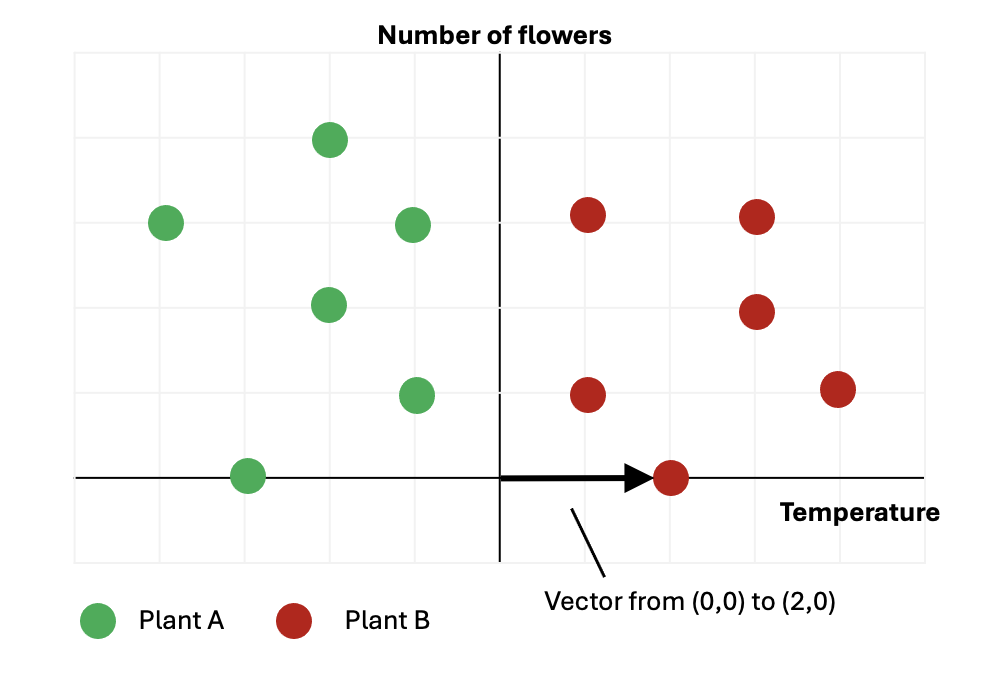
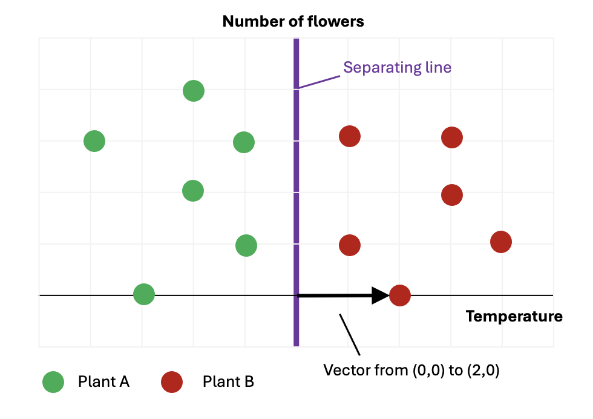

## Vector Classification

Vectors can also be used to solve **classification problems** in Machine Learning.

Classification is the task of assigning items to **discrete categories**. For example, recognising handwritten letters is a classification problem because each letter belongs to one of **26 categories**. In contrast, temperature is **not** a classification problem because it varies continuously.

### Example: Classifying Plants

Suppose we have data for 12 plants belonging to two species (A and B), with the following features:

- Average temperature where the plant grows  
- Number of flowers  

We can represent each plant as a **vector** in a 2D feature space:
- X-axis → temperature  
- Y-axis → number of flowers  

Plotting the data and colour-coding by species:

- Green → Plant A  
- Red → Plant B  

{width="60%"}

From inspection, the plants appear separable based on temperature.

---

### Using a Vector to Classify

Instead of visually inspecting the plot, we can define a **vector** that separates the two classes.

For example, consider the vector:

\[
\mathbf{w} = (2, 0)
\]

We compute the **dot product** between this vector and each plant:

\[
\mathbf{w} \cdot \mathbf{x}
\]

This gives a scalar value for each plant.

{width="60%"}

### Classification Rule

- If \( \mathbf{w} \cdot \mathbf{x} > 0 \) → classify as **Plant B**  
- If \( \mathbf{w} \cdot \mathbf{x} < 0 \) → classify as **Plant A**

---

### Geometric Interpretation

The key idea:

- The vector **defines a direction**
- The **decision boundary** is a line **perpendicular** to that vector
- This line separates the two classes

{width="60%"}

Any point on one side of the boundary has a positive dot product, and any point on the other side has a negative dot product.

---

### Key Insight

Classification reduces to finding a vector such that:

- Points from one class produce **positive dot products**
- Points from the other class produce **negative dot products**

This is the foundation of many classification algorithms, including **linear classifiers** such as logistic regression and support vector machines.