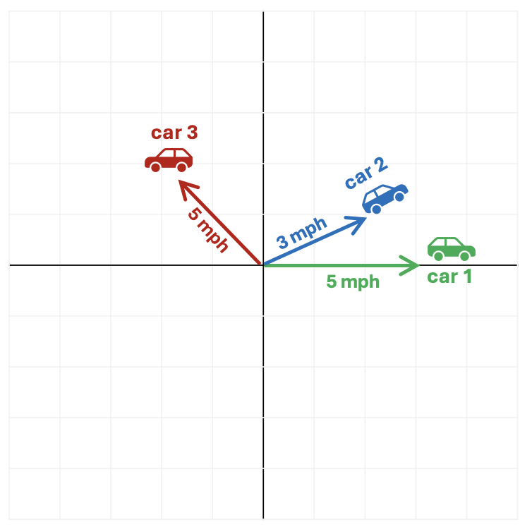

# An Overview of Vectors and why they're fundamental to Machine Learning

A vector is a quantity that has both magnitude and direction (magnitude refers to the amount of something). They’re used extensively in physics to represent forces. For example, you may have heard the phrase “velocity vector,” which captures the magnitude (speed) and direction of a moving object - for example “driving east at 30 kph” or a machine in a factory might be specified to “apply a force of 10 newtons vertically down” - the magnitude of the force is 10 newtons and the direction is downwards.

Vectors are also widely used in machine learning because they provide a mechanism to find similarities between different quantities.

## Example: Comparing Car Movements

For example, imagine three cars start from the same point and move as follows.

- **Car 1 (green):** Heads to east at 5mph  
- **Car 2 (blue):** Heads slightly north east at 3mph (let’s say it’s 30 degrees to the North of East)  
- **Car 3 (red):** Heads north west at 5mph (let’s say directly North West - or 45 degrees from West or 135 degrees from the East!)

{width="50%"}

## Which cars are most similar?

Most people would intuitively say that the motion of Car 1 and Car 2 is quite similar because they’re moving in roughly the same direction and at roughly the same speed.

Whereas although Car 1 and Car 3 are moving at the same speed, they’re going in completely different directions so intuitively their motions aren’t very similar.

## Representing Motion as Vectors

We can reach the same conclusion mathematically by using vectors to represent the motion of the cars. Recalling that a vector has both magnitude and direction, in this example we can use speed as the magnitude and the direction of travel as the direction.

Using this vector representation we would have:

- **Car 1 (green):** (5, 0 degrees)  
- **Car 2 (blue):** (3, 30 degrees)  
- **Car 3 (red):** (5, 135 degrees)

## Vector Comparison

To compare two vectors mathematically, we use the following formula:

> **(Magnitude of vector 1 × Magnitude of vector 2) × Cosine of the angle between them**

| Comparison        | Similarity using vector comparison | Result |
|------------------|----------------------------------|--------|
| Car 1 and Car 2  | (5 × 3) × Cosine 30              | 7.8    |
| Car 1 and Car 3  | (5 × 5) × Cosine 135             | -10.6  |
| Car 2 and Car 3  | (3 × 5) × Cosine 105             | -3.9   |

These results reinforce our intuition - the motion of Car 1 and Car 2 are most alike but Car 1 and Car 3 are least alike.

## Why is this significant?

Machine learning often involves finding patterns in data - in other words, identifying similarities between different examples. If we can represent things as vectors, we can use vector comparison to measure how similar they are. This allows us to compare words, images, or user behaviour in a consistent and scalable way.

## How do we represent things like words, images, or even people as vectors?

The key idea is to break things down into measurable features and represent them as numbers.

### Words

We can represent words based on how they are used:

- how often they appear near other words  
- the contexts they appear in  

Modern language models learn these patterns automatically, producing vectors where words used in similar ways have similar representations.

### Images

- An image is made up of pixels, each with a brightness or colour value  
- We can represent the image as a long list of numbers describing those pixel values  

More advanced approaches extract higher-level features such as shapes or textures, but the principle is the same.

### People

We can describe people using measurable attributes:

- Height  
- Weight  
- Average heart rate  
- Sex (e.g. 1 = male, 0 = female)  
- Smoker (1 = yes, 0 = no)

Each person becomes a vector of numbers representing their characteristics.

## Bringing It All Together

Once everything is represented as vectors, we can compare them using the same mathematical tools to find similarities.

A practical example is health diagnostics. If we record common features of individuals as vectors and say some of those people have heart disease and some do not, we can compare these vectors to identify people with similar features and estimate their risk by calculating how “similar” they are to those in the at-risk group.
